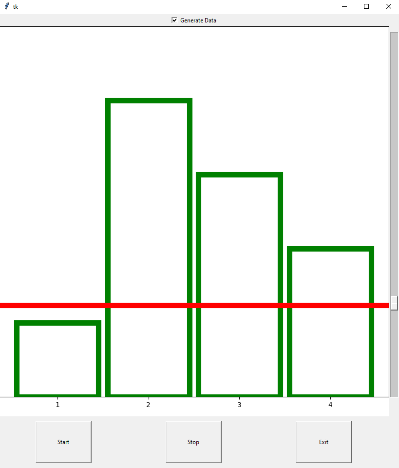

# Sensorimotor Training Task
## Materials
- Arduino UNO (x1)
- Breadboard (x1)
- Potentiometer (x4)
- Assorted jumper wires

## Software
- Python 3.8
- tkinter
- numpy
- PySerial
- Matplotlib

## How to Use

- User the slider to adjust horizontal bar height
- If Arduino is connected, click 'Start' to begin reading data.
- If Arduino is not connected to system, random values can be generated by checking 'Generate Data' then clicking the 'Start' button.
- To stop displaying data, click the 'Stop' button.
- Select 'Exit' to stop all processes and close the GUI.